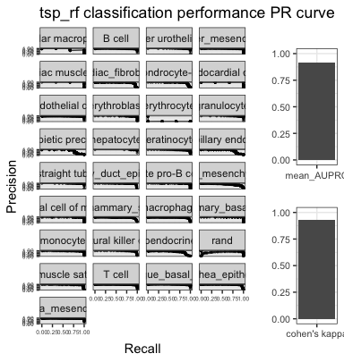
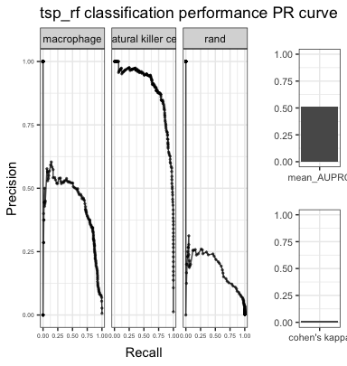

```{r, warning=FALSE}
library(fgsea)
library(devtools)
library(singleCellNet)
library(RColorBrewer)
library(pheatmap)
library(randomForest)
library(viridis)
library(ggplot2)
library(dplyr)
library(pROC)
library(viridis)
library(patchwork)
library(DescTools)
library(parallel)

mydate<-utils_myDate()
```

```{r data fetching}
download.file("https://s3.amazonaws.com/cnobjects/singleCellNet/examples/sampTab_Park_MouseKidney_062118.rda", "sampTab_Park_MouseKidney_062118.rda")

download.file("https://s3.amazonaws.com/cnobjects/singleCellNet/examples/expDat_Park_MouseKidney_062218.rda", "expDat_Park_MouseKidney_062218.rda")

download.file("https://s3.amazonaws.com/cnobjects/singleCellNet/examples/expTM_Raw_053018.rda", "expTM_Raw_053018.rda")

download.file("https://s3.amazonaws.com/cnobjects/singleCellNet/examples/sampTab_TM_053018.rda", "sampTab_TM_053018.rda")

## For cross-species analyis:
download.file("https://s3.amazonaws.com/cnobjects/singleCellNet/examples/human_mouse_genes_Jul_24_2018.rda", "human_mouse_genes_Jul_24_2018.rda")

download.file("https://s3.amazonaws.com/cnobjects/singleCellNet/examples/6k_beadpurfied_raw.rda", "6k_beadpurfied_raw.rda")

download.file("https://s3.amazonaws.com/cnobjects/singleCellNet/examples/stDat_beads_mar22.rda", "stDat_beads_mar22.rda")

```

```{r}
expPark<-utils_loadObject("expDat_Park_MouseKidney_062218.rda")
dim(expPark)
genesPark<-rownames(expPark)
rm(expPark)

expTMraw<-utils_loadObject("expTM_Raw_053018.rda")
dim(expTMraw)
#[1] 23433 24936

stTM<-utils_loadObject("sampTab_TM_053018.rda")
dim(stTM)
#[1] 24936    17

stTM<-droplevels(stTM)

commonGenes<-intersect(rownames(expTMraw), genesPark)
length(commonGenes)
#[1] 13831

expTMnorm<-trans_prop(weighted_down(expTMraw[commonGenes,], 1.5e3, dThresh=0.25), 1e4)

stList<-splitCommon(stTM, ncells=100, dLevel="newAnn")
stTrain<-stList[[1]]
expTrain<-expTMnorm[,rownames(stTrain)]

system.time(cgenes2<-findClassyGenes(expTrain, stTrain, "newAnn", topX=10))
 
cgenesA<-cgenes2[['cgenes']]
grps<-cgenes2[['grps']]
length(cgenesA)
#[1] 481

# heatmap these genes
hm_gpa_sel(expTrain, cgenesA, grps, maxPerGrp=5, toScale=T, cRow=F, cCol=F,font=4)

system.time(xpairs<-ptGetTop(expTrain[cgenesA,], grps, topX=50, sliceSize=5000))
length(xpairs)

system.time(pdTrain<-query_transform(expTrain[cgenesA, ], xpairs))
dim(pdTrain)

system.time(rf_tspAll<-sc_makeClassifier(pdTrain[xpairs,], genes=xpairs, groups=grps, nRand=100, ntrees=1000))

stTest<-stList[[2]]

system.time(expQtransAll<-query_transform(expTMraw[cgenesA,rownames(stTest)], xpairs))

nrand<-100
system.time(classRes_val_all<-rf_classPredict(rf_tspAll, expQtransAll, numRand=nrand))
 
sla<-as.vector(stTest$newAnn)
names(sla)<-rownames(stTest)
slaRand<-rep("rand", nrand)
names(slaRand)<-paste("rand_", 1:nrand, sep='')

sla<-append(sla, slaRand)

sc_hmClass(classRes_val_all, sla, max=300, isBig=TRUE)
```

###assessment
```{r}
comm <- SubsetQueryBasedOnTraining(stTest, stTrain = stTrain, dLevelSID = "cell",classTrain = "newAnn", classQuery = "newAnn",ct_scores = classRes_val_all,nRand = 100)
tm_heldoutassessment <- assessmentReport_comm(comm$ct_score_com, classLevels = "newAnn",comm$stVal_com, dLevelSID = "cell")
plot_multiAssess(tm_heldoutassessment, method = "tsp_rf") 
```


```{r}
stPark<-utils_loadObject("sampTab_Park_MouseKidney_062118.rda")
expPark<-utils_loadObject("expDat_Park_MouseKidney_062218.rda")
dim(expPark)
#[1] 16272 43745

system.time(kidTransAll<-query_transform(expPark[cgenesA,], xpairs))
nqRand<-100
system.time(crParkall<-rf_classPredict(rf_tspAll, kidTransAll, numRand=nqRand))

sgrp<-as.vector(stPark$description1)
names(sgrp)<-rownames(stPark)
grpRand<-rep("rand", nqRand)
names(grpRand)<-paste("rand_", 1:nqRand, sep='')
sgrp<-append(sgrp, grpRand)

sc_hmClass(crParkall, sgrp, max=5000, isBig=TRUE, cCol=F, font=8)

stKid2<-addRandToSampTab(crParkall, stPark, "description1", "sample_name")
skylineClass(crParkall, "T cell", stKid2, "description1",.25, "sample_name")
```

###assessment
```{r}
comm <- SubsetQueryBasedOnTraining(stPark, stTrain = stTrain, dLevelSID = "sample_name",classTrain = "newAnn", classQuery = "description1",ct_scores = crParkall,nRand = 100)
park_assessment <- assessmentReport_comm(comm$ct_score_com, classLevels = "description1",comm$stVal_com, dLevelSID = "sample_name")
plot_multiAssess(park_assessment, method = "tsp_rf") 
```


